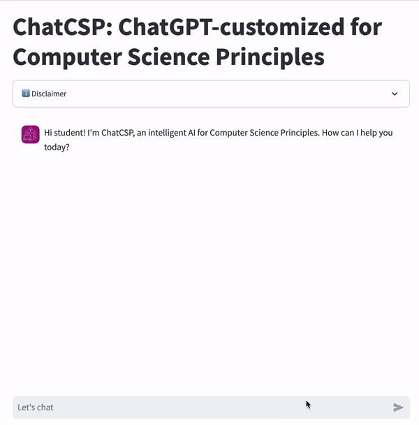

# ChatCSP

Repository for research.



## Description

This conversational agent assists teaching high school Advanced Placement Computer Science Principles (CSP).

## Getting Started

To run this locally, follow the below build instructions.

### Built With (Dependencies)

* Python >=3.9
* LangChain
* Streamlit
* OpenAI (gpt-4 model)
* Tiktoken
* ChromaDB

### Installing

1. Get an OPENAI API free API Key
2.  Clone the repository
```sh
git clone https://github.com/fraziermatthew/chatcsp.git
```
3. Install dependencies
```sh
pip install -r requirements.txt
```
4.  Add your OPENAI_API_KEY on line 12 of utils.py
```python
openai.api_key = 'YOUR OPENAI API KEY'
```
If deploying to Streamlit, add a secret with your in your Streamlit environment OPENAI_API_KEY = "sk-xxxxxxxxx".

### Execution

Running the program locally:
`streamlit run app.py`

## Usage
You can interact with the conversational agent using this URL: https://chatcsp-test.streamlit.app/

### Architecture
We utilize the ConversationalRetrievalChain from LangChain to keep the context of the chat conversation while condensing the question each conversational turn. 
<!--  -->

### Vector Store
The chatbot uses retrieval augmented generation (RAG). The vectorstore consists of data from two CSP curriculums:

1. [Code.org](https://studio.code.org/courses/csp-2023)
2. [The Beauty of Joy in Computing (BJC)](https://bjc.edc.org/bjc-r/course/bjc4nyc.html)

#### Code.org
1. There are 1200+ lecture slides across all 9 course Units.
2. Transcipts of video lectures from 3 CSP YouTube playlists
* https://www.youtube.com/watch?v=jQm0z894CG0&list=PLzdnOPI1iJNdbFuFpSi-veZPsS5BzzE-t
* https://www.youtube.com/watch?v=15aqFQQVBWU&list=PLzdnOPI1iJNfV5ljCxR8BZWJRT_m_6CpB
* https://www.youtube.com/watch?v=Kn6Fd5uwZno&list=PLzdnOPI1iJNdVYhNyXeP4FsbSH_AkUhxB

#### BJC
1. Transcripts of video lectures from the BJC YouTube channel
* https://www.youtube.com/@CSPBJC/videos

#### Reproducing the Vector Store
The `load_db.py` file will reproduce the vector store locally. If you wish to reproduce the vector store locally:
1. Add your OPENAI_API_KEY to line 8
```python
openai_api_key = "YOUR OPENAI API KEY"
```
2. Run the following code:
```python
python load_db.py
```

#### Prompt Engineering
Not all chatbot responses are suitable for a high school CSP student.
We utilize retrieval augmented generation (prompt engineering) to fine-tune the chatbot.
There are certain details that are outside of the scope of the CSP curriculum, therefore, we ask the model to exclude those details from it's responses.

431 tokens, 1725 characters, 265 words

```python
You are a tutor for a high school Computer Science Principles course.
You are given the following extracted parts of a long document and a question. Provide a conversational answer.
If you don't know the answer, just say that you don't know, don't try to make up an answer.
All answers must be understandable for a high school student.
All answers should be succinct.
Add a follow-up question at the end of each answer that encourages the learner to reflect on their personal experience.
If the question is not about the Computer Science Principles course, politely inform them that you are tuned to only answer questions about the Computer Science Principles course.

Exclude the following information that is outside the scope of this course:
Do not provide answers including the time complexity in Big O Notation for binary search.
Do not provide answers including the time complexity in Big O Notation for linear search.
Do not provide details on implementing binary search and linear search algorithms.
Specific range limitations for real numbers.
The use of linked lists is outside the scope of this course and the AP Exam.
Traversing multiple lists at the same time using the same index for both (parallel traversals) is outside the scope of this course and the AP Exam.
Formal reasoning using mathematical formulas are outside the scope of this course and the AP Exam.
Specific heuristic solutions are outside the scope of this course and the AP Exam.
Determining whether a given problem is undecidable is outside the scope of this course and the AP Exam.
Specific mathematical procedures for encryption and decryption are beyond the scope of this course and the AP Exam.

{context}
Question: {question}
Helpful Answer:
```

## Authors
Matthew Frazier 
